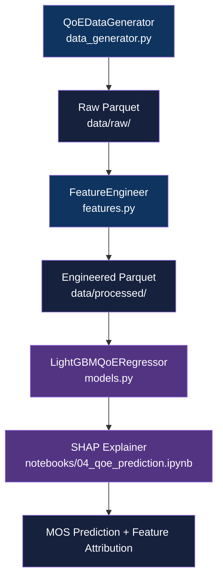

<div align="center">

# Telecom QoE Prediction

[](https://www.python.org/downloads/)
[](https://lightgbm.readthedocs.io/)
[](LICENSE)

**Predict user Quality of Experience (MOS score) from session-level network KPIs using LightGBM and SHAP**

[Getting Started](#getting-started) | [Usage](#usage) | [Methodology](#methodology)

</div>

---

## Table of Contents

- [Features](#features)
- [Tech Stack](#tech-stack)
- [The Problem](#the-problem)
- [Architecture](#architecture)
- [Getting Started](#getting-started)
  - [Prerequisites](#prerequisites)
  - [Installation](#installation)
- [Usage](#usage)
- [Methodology](#methodology)
- [Results](#results)
- [Data Engineering](#data-engineering)
- [Project Structure](#project-structure)
- [Testing](#testing)
- [Related Projects](#related-projects)
- [License](#license)
- [Author](#author)

## The Problem

### Predicting Perceived Service Quality in Telecom Networks

Network KPIs (SINR, throughput, latency) are observable in real time, but the user's perceived quality is not. Carriers lack a fast, per-session signal to act on before churn risk materializes.

### The Solution

Train a LightGBM regressor on synthetic ITU-T-inspired session data to predict MOS directly from network and app-context features, then use SHAP to surface which factors drive degradation for each segment.

## Features

- **LightGBM regression** - gradient-boosted trees trained against MOS on 10K synthetic sessions with 5-fold cross-validation
- **Feature engineering pipeline** - composite network quality index, service degradation score, bandwidth utilization, and app-sensitivity weights per session
- **SHAP explainability** - per-session feature attribution to identify why a session scored low (latency vs. packet loss vs. signal)
- **Synthetic data generator** - ITU-T-inspired MOS formula with app-specific adjustments for gaming, video, VoIP, browsing, and social traffic
- **Data quality tests** - pytest suite validating range constraints, categorical domains, and generator reproducibility

## Tech Stack

| Component | Technology |
|-----------|------------|
| Language | Python 3.11+ |
| ML model | LightGBM 4.1+ |
| Explainability | SHAP 0.42+ |
| Data | pandas, NumPy, pyarrow |
| Visualization | Matplotlib, seaborn |
| Notebook | Jupyter Lab |
| Packaging | uv + pyproject.toml |
| Testing | pytest + pytest-cov |

## Architecture



## Getting Started

### Prerequisites

- Python 3.11+
- [uv](https://github.com/astral-sh/uv) package manager

```bash
# Install uv if not already present
curl -LsSf https://astral.sh/uv/install.sh | sh
```

### Installation

1. Clone the repository:
   ```bash
   git clone https://github.com/adityonugrohoid/telecom-qoe-prediction.git
   cd telecom-qoe-prediction
   ```

2. Install dependencies:
   ```bash
   uv sync
   ```

## Usage

Generate synthetic data, engineer features, then open the analysis notebook:

```bash
# Generate 10K synthetic sessions
uv run python -m qoe_prediction.data_generator

# Run the feature engineering pipeline
uv run python -m qoe_prediction.features

# Launch the Jupyter notebook
uv run jupyter lab notebooks/04_qoe_prediction.ipynb
```

To execute the notebook non-interactively:

```bash
uv run jupyter nbconvert --to notebook --execute notebooks/04_qoe_prediction.ipynb
```

## Methodology

### Problem Framing

| Attribute | Value |
|-----------|-------|
| Problem Type | Regression |
| Target Variable | `mos_score` (MOS 1-5 scale) |
| Primary Metric | RMSE |
| Key Challenge | Non-linear MOS curve; app-specific sensitivity; irreducible subjective noise |

### Training Approach

| Parameter | Value |
|-----------|-------|
| Algorithm | LightGBM (`LGBMRegressor`) |
| Features | 7 raw + 4 engineered interaction features |
| Validation | 5-fold cross-validation, 80/20 train-test split |
| Regularization | L1 (alpha=0.1), L2 (lambda=0.1), subsample=0.8, colsample=0.8 |
| Baseline | Mean MOS prediction |

### Engineered Features

- `network_quality_index` - composite of normalized SINR and throughput (0.5 each)
- `service_degradation` - latency/100 + packet loss rate * 2
- `bandwidth_utilization` - data volume vs. theoretical session capacity
- `app_sensitivity_score` - per-app latency sensitivity weight (gaming: 0.9, VoIP: 0.85, video: 0.8, browsing: 0.3)

## Results

### Key Findings

| Metric | Score | Notes |
|--------|-------|-------|
| RMSE | 0.45 | On held-out test set, MOS scale 1-5 |
| R2 | 0.58 | Unobserved subjective factors cap ceiling |
| Gaming RMSE | 0.47 | Highest per-segment error; latency sensitivity |

### Top Predictors (SHAP)

1. `service_degradation` - strongest driver; combines latency and packet loss into a single penalty signal
2. `throughput_mbps` - directly limits video and download quality
3. `latency_ms` - critical for gaming and VoIP; drives gaming segment's elevated RMSE

## Data Engineering

| Attribute | Value |
|-----------|-------|
| Data Source | Synthetic (ITU-T-inspired MOS formula) |
| Records | 10,000 sessions |
| Features | 7 raw network/context features, 4 engineered |
| App types | video streaming, browsing, gaming, social, VoIP |
| Device classes | low, mid, high capability tiers |
| Domain physics | App-specific MOS adjustments; gaming sensitive to latency, video to throughput and packet loss |

## Project Structure

```
telecom-qoe-prediction/
├── notebooks/
│   └── 04_qoe_prediction.ipynb    # Full analysis: EDA, training, SHAP
├── src/
│   └── qoe_prediction/
│       ├── config.py              # Centralized config (paths, hyperparams)
│       ├── data_generator.py      # Synthetic session generator (ITU-T formula)
│       ├── features.py            # FeatureEngineer pipeline
│       └── models.py              # LightGBMQoERegressor + base class
├── tests/
│   └── test_data_quality.py       # Data range, type, and distribution tests
├── data/
│   ├── raw/                       # Generated parquet (gitignored)
│   └── processed/                 # Engineered features (gitignored)
├── pyproject.toml                 # uv + hatchling build config
└── QUICKSTART.md                  # Five-minute setup guide
```

## Testing

```bash
# Run all tests
uv run pytest tests/ -v

# Run with coverage
uv run pytest tests/ -v --cov=src/qoe_prediction
```

Tests cover data range constraints (SINR -5 to 25 dB, MOS 1-5), categorical domain validation (network type, device class, app type), MOS distribution sanity, and generator reproducibility.

## Related Projects

| Project | Description |
|---------|-------------|
| [telecom-ml-framework](https://github.com/adityonugrohoid/telecom-ml-framework) | Spec-first ML project templates and domain-informed data generators for 6 telecom use cases |
| [telecom-ml-portfolio](https://github.com/adityonugrohoid/telecom-ml-portfolio) | Index of 6 end-to-end telecom ML projects on synthetic network data |
| [telecom-churn-prediction](https://github.com/adityonugrohoid/telecom-churn-prediction) | Binary classification predicting subscriber churn (XGBoost, AUROC 0.86) |
| [telecom-root-cause-analysis](https://github.com/adityonugrohoid/telecom-root-cause-analysis) | Multi-class ranking of root causes in alarm cascades (XGBoost, Acc@1 0.91) |
| [telecom-anomaly-detection](https://github.com/adityonugrohoid/telecom-anomaly-detection) | Unsupervised cell-level anomaly detection on KPI time-series (Isolation Forest, F1 0.70) |
| [telecom-capacity-forecasting](https://github.com/adityonugrohoid/telecom-capacity-forecasting) | Hourly per-cell traffic forecasting (LightGBM, MAPE 14.5%) |
| [telecom-network-optimization](https://github.com/adityonugrohoid/telecom-network-optimization) | RL-based RAN parameter tuning (Q-Learning, +61% vs random) |

## License

This project is licensed under the [MIT License](LICENSE).

## Author

**Adityo Nugroho** ([@adityonugrohoid](https://github.com/adityonugrohoid))
